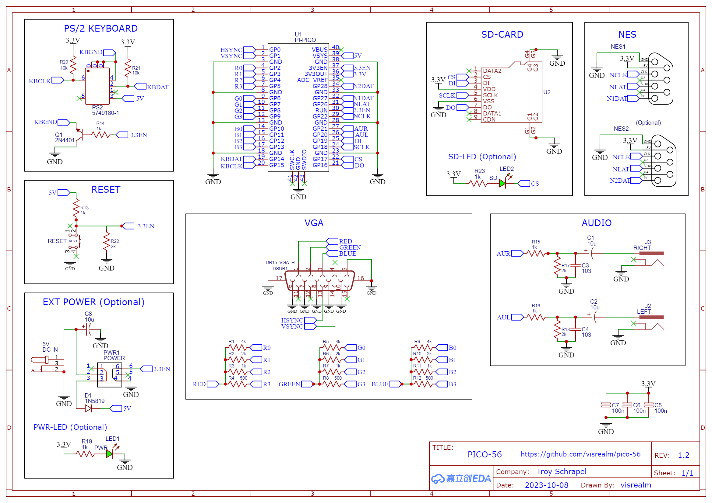

# PICO-56
My [HBC-56](https://github.com/visrealm/hbc-56), a 65C02/TMS9918A homebrew computer on a backplane, fully emulated on a Raspberry Pi Pico.

Emulating the following HBC-56 hardware
* 65C02 CPU
* 65C22 VIA
* TMS9918A VDP
* Dual AY-3-8910 PSGs
* Dual NES controller inputs
* PS/2 keyboard input
* 96KB Banked RAM/ROM

Making use of my various emulation libraries (and more):

* [vrEmu6502](https://github.com/visrealm/vrEmu6502) - 6502/65C02 CPU emulation library (C99)
* [vrEmu6522](https://github.com/visrealm/vrEmu6522) - 6522/65C22 VIA emulation library (C99)
* [vrEmuTms9918](https://github.com/visrealm/vrEmuTms9918) - TMS9918A/TMS9929A VDP emulation library (C99)

This is the placeholder repository for the up-coming video series covering the development of the PICO-56.

Follow along on YouTube here: [youtube.com/@TroySchrapel](https://youtube.com/@TroySchrapel)

### Gerbers

Gerbers for the PICO-56 v1.2 are now available. See [/schematics](schematics)

### Bill of materials

| Qty.     | Description                       | Code                              |
|----------|-----------------------------------|-----------------------------------|
| 1        | PICO-56 PCB                       | PCB                               |
| 2        | 10nf (103) ceramic capacitor      | C3,C4                             |
| 3        | 100nf (104) ceramic capacitor     | C5,C6,C7                          |
| 3        | 10uf (106) electrolytic capacitor | C8,C1,C2                          |
| 3        | 4kΩ 0.25w resistor                | R1,R5,R9                          |
| 2        | 10kΩ 0.25w resistor               | R20,R21                           |
| 6        | 2kΩ 0.25w resistor                | R22,R2,R6,R10,R17,R18             |
| 9        | 1kΩ 0.25w resistor                | R3,R7,R11,R13,R14,R15,R16,R19,R23 |
| 3        | 500Ω 0.25w resistor               | R4,R8,R12                         |
| 1        | 2N4401 transistor                 | Q1                                |
| 1        | 1N5819 diode                      | D1                                |
| 1        | Blue LED                          | LED1                              |
| 1        | Green LED                         | LED2                              |
| 1        | Push button                       | KEY1                              |
| 1        | Push button (locking)             | PWR1                              |
| 1        | Barrel jack connector             | 5V                                |
| 1        | VGA connector                     | DSUB1                             |
| 2        | RCA connector                     | J2,J3                             |
| 1        | NES connector                     | NO1,NO2                           |
| 1        | PS/2 connector                    | PS2                               |
| 1        | Raspberry Pi Pico (plus headers)  | U1                                |
| 1        | MicroSD card connector            | U2                                |

### Schematics

### Thanks

Thanks to [PCBWay](https://pcbway.com/g/186WQ9) for supporting this project.

## License
This code is licensed under the [MIT](https://opensource.org/licenses/MIT "MIT") license
